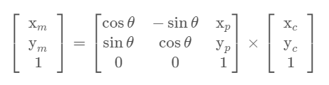

# Kidnapped Vehicle
---
## Rubric Points
---
Here I will consider [the rubic points](https://review.udacity.com/#!/rubrics/747/view) individually and describe how I addressed each point in my implementation.

## My particle filter localize the vehicle to within the desired accuracy  
As a result of executing the simulation, "Success! Your particle filter passed!" id displayed.
Therefore, it meets the criteria.  

## My particle run within the specified time of 100 seconds  
As you can see in the image above, it runs in 48.86 seconds, which meets the criteria.

## My code use a particle filter to localize the robot.
1. Overall processing  
  In main.cpp, Initialization to Resample are repeated as shown in the figure.  
  It is described in lines 64-112 of `src/main.cpp`.  
  
1. Initialization  
  Generate random numbers using the specified standard edition centering on the coordinates and orientation specified by the argument for 100 particles.  
  It is described in lines 28-57 of `src/particle_filter.cpp`.  

1. Prediction Step  
  The particles are moved using the given Δt, velocity, and yaw rate.At that time, the calculation formula differs as follows depending on the size of the yaw rate.  
  It is described in lines 64-99 of `src/particle_filter.cpp`.  
  
  

1. Update Weights  
  The weight of the particle is updated by the following flow using the landmark.  
  It is described in lines 133-199 of `src/particle_filter.cpp`.
    1. Homogeneous transformation  
      Since the observation data is relative coordinates from the car, convert it to the absolute coordinates of the map information using the Homogeneous transformation shown in the figure below.  
      
    1. Get a list of landmarks  
      List landmarks within the sensor range.
    1. Data Association  
      Get the closest ID using the landmark list.  
      It is described in lines 107-125 of `src/particle_filter.cpp`.
    1. Final weight calculation  
      The final weight of the particles is calculated as the product of the multivariate Gaussian distribution probability densities of each measurement. 
      The formula for the multivariate Gaussian distribution is as follows.  
      
